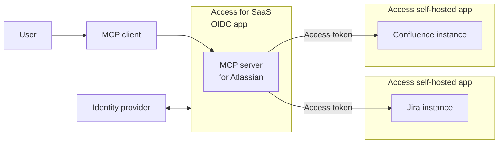

import { Render, GlossaryTooltip } from "~/components"

You can secure <GlossaryTooltip term="MCP server">Model Context Protocol (MCP) servers</GlossaryTooltip> by using Cloudflare Access as the Single Sign-On (SSO) provider. When users connect to the remote MCP server using an <GlossaryTooltip term="MCP client">MCP client</GlossaryTooltip>, they will be prompted to log in to your [identity provider](/cloudflare-one/identity/idp-integration/) and are only granted access if they pass your [Access policies](/cloudflare-one/policies/access/#selectors).

Cloudflare Access can also delegate access from any [self-hosted application](/cloudflare-one/applications/configure-apps/self-hosted-public-app/) to the MCP server via <GlossaryTooltip term="OAuth">OAuth</GlossaryTooltip>. The OAuth grant authorizes the MCP server to make requests to your self-hosted applications on behalf of the user, using the user's specific permissions and scopes. For example, your organization may wish to deploy an MCP server that helps employees interact with internal Atlassian applications. You can configure Access policies to ensure that only authorized users can access those applications, either directly or by using AI.

## Prerequisites

- An [identity provider](/cloudflare-one/identity/idp-integration/) configured in Cloudflare Zero Trust

## 1. Add a SaaS application to Cloudflare Zero Trust

1. In [Zero Trust](https://one.dash.cloudflare.com), go to **Access** > **Applications**.
2. Select **SaaS**.
3. For **Application**, select *Salesforce*.
4. For the authentication protocol, select **OIDC**.
5. Select **Add application**.
6. In **Scopes**, select the attributes that you want Access to send in the ID token.
7. In **Redirect URLs**, enter the callback URL obtained from Salesforce (`https://<your-domain>.my.salesforce.com/services/authcallback/<URL Suffix>`). Refer to [Add a SSO provider to Salesforce](#2-add-a-sso-provider-to-salesforce) for instructions on obtaining this value.
8. (Optional) Enable [Proof of Key Exchange (PKCE)](https://www.oauth.com/oauth2-servers/pkce/) if the protocol is supported by your IdP. PKCE will be performed on all login attempts.
9. Copy the following values:
   * **Client ID**
   * **Client Secret**
   * **Authorization endpoint**
   * **Token endpoint**
   * **User info endpoint**
10. Configure [Access policies](/cloudflare-one/policies/access/) for the application.
11. (Optional) In **Experience settings**, configure [App Launcher settings](/cloudflare-one/applications/app-launcher/) by turning on **Enable App in App Launcher** and, in **App Launcher URL**, entering `https://<your-domain>.my.salesforce.com`.
12. Save the application.

## 2.