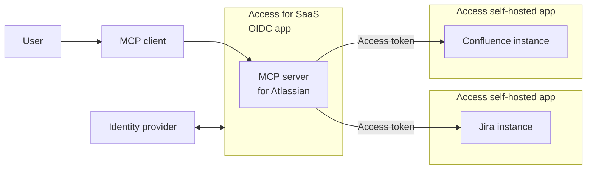

import { Render, GlossaryTooltip } from "~/components"

Cloudflare Access can delegate access from any [self-hosted application](/cloudflare-one/applications/configure-apps/self-hosted-public-app/) to an [Access for SaaS MCP server](/cloudflare-one/applications/configure-apps/mcp-servers/saas-mcp/) via <GlossaryTooltip term="OAuth">OAuth</GlossaryTooltip>. The OAuth grant authorizes the MCP server to make requests to your self-hosted applications on behalf of the user, using the user's specific permissions and scopes.

For example, your organization may wish to deploy an MCP server that helps employees interact with internal Atlassian applications. You can configure [Access policies](/cloudflare-one/policies/access/#selectors) to ensure that only authorized users can access those applications, either directly or by using an <GlossaryTooltip term="MCP client">MCP client</GlossaryTooltip>.

## Prerequisites

## 1. Create an Access policy

## 2. Update the self-hosted app

## 3. Configure the MCP server

## Known limitations

